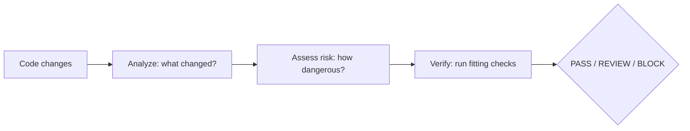

# AI Verify

> AI can generate code. AI Verify helps verify it.

[](https://www.npmjs.com/package/@fisaabil_/ai-verify)
[](https://www.npmjs.com/package/@fisaabil_/ai-verify)
[](https://nodejs.org/)
[](https://github.com/muhammadfisabilillah/ai-verify/actions/workflows/ci.yml)

AI Verify is open-source, risk-adaptive verification infrastructure for
AI-generated software. It analyzes what changed, assesses how risky it is, and
runs only the checks that fit — then reports a clear `PASS` / `REVIEW` /
`BLOCK` verdict. Terminal-first, zero-config, local-only.

## Contents

- [Quick start](#quick-start)
- [How it works](#how-it-works)
- [Verifiers](#verifiers)
- [Risk levels](#risk-levels)
- [Verdicts and exit codes](#verdicts-and-exit-codes)
- [Output](#output)
- [GitHub Action](#github-action)
- [Install options](#install-options)
- [Requirements](#requirements)
- [From source](#from-source)
- [Honesty rules](#honesty-rules)
- [Roadmap](#roadmap)
- [Contributing](#contributing)
- [License](#license)

## Quick start

No clone, no install — point it at any Git repository with uncommitted changes:

```bash
npx @fisaabil_/ai-verify@latest /path/to/your/repo
```

## How it works



1. **Analyze** — reads the Git diff: files, additions/deletions, languages.
2. **Assess risk** — scores 0–100 from security-sensitive paths, change size,
   and test coverage, with a reason for every factor.
3. **Verify** — runs only the checks relevant to the changed files and
   aggregates findings in one format. Risk selects verification depth; it
   never blocks on its own.

## Verifiers

| Check        | Runs when                        | Tool used                       |
| ------------ | -------------------------------- | ------------------------------- |
| Type Check   | TypeScript files changed         | `tsc` from the target repo      |
| Lint         | JavaScript/TypeScript changed    | `ESLint` + config in target repo |
| JS/TS Tests  | JS/TS test files changed         | `vitest` in the target repo     |
| Ruff         | Python files changed             | `ruff` on `PATH`                |
| Python Tests | Python test files changed        | `pytest` in the environment     |
| Secret Scan  | Any file added or modified       | Built in (no external tool)     |

A missing tool is **skipped with a reason** — never downloaded or installed
for you. A crashed tool is reported as `error`, never silently passed.
Secret Scan needs no tool at all: high-confidence findings (provider-shaped
tokens, private keys) are `critical` and always `BLOCK`; heuristic matches
are `high` (`REVIEW` at low risk, `BLOCK` at high risk). Secret values are
never echoed into findings.

## Risk levels

| Level      | Score  | Typical trigger                      |
| ---------- | ------ | ------------------------------------ |
| `NONE`     | 0      | Docs-only changes                    |
| `LOW`      | 1–29   | Config, small changes with tests     |
| `MEDIUM`   | 30–59  | Auth/DB touch, or code without tests |
| `HIGH`     | 60–89  | Payment/secrets/security-sensitive   |
| `CRITICAL` | 90–100 | Combined high-risk factors at scale  |

## Verdicts and exit codes

| Verdict  | Meaning                                                        | Exit |
| -------- | -------------------------------------------------------------- | ---- |
| `PASS`   | All applicable checks passed, nothing found                    | 0    |
| `REVIEW` | A check failed, a finding needs a human, or risky change unverified | 1    |
| `BLOCK`  | A tool errored, a `critical` finding, or a `high` finding in `high`/`critical` risk | 1    |

## Output

<details>
<summary><b>Click to expand a full annotated example</b></summary>

```text
AI Verify v0.2.1 — AI can generate code. AI Verify helps verify it.
------------------------------
Files changed : 2
Additions     : +34
Deletions     : -4

Changes:
  modified src/auth/login.ts (typescript) +30/-4
  added    tests/auth.test.ts (typescript) +4/-0

Risk: MEDIUM (42)
Factors:
  +30 Authentication change — Touches authentication or authorization logic: src/auth/login.ts

Verification (857ms)
  ✓ Type Check — passed
Findings: 0
Result: PASS
```

</details>

- **Changes** — what the analyzer found in the working tree vs `HEAD`.
- **Risk** — level + score + one line per factor, always with a reason.
- **Verification** — one line per check that applied, then findings, then verdict.
- **Machine-readable** — `--json` prints `{ changeSet, risk, verification, verdict }`
  for CI and AI agents. See `examples/` for samples; `--help` lists all flags.
- **Run history** — every run appends a one-line summary to
  `~/.cache/ai-verify/runs.jsonl` (override with `AI_VERIFY_HISTORY_FILE`).
  No file contents are recorded. Use `--no-history` to opt out.

## GitHub Action

GitHub-hosted runners already provide Node.js `>= 18` — check out, then verify:

```yaml
- uses: actions/checkout@v4
- uses: muhammadfisabilillah/ai-verify@v0.2.1
```

The step fails on `REVIEW`/`BLOCK`. The verdict is also exposed for
conditional follow-ups:

```yaml
- id: verify
  uses: muhammadfisabilillah/ai-verify@v0.2.1
- if: steps.verify.outputs.verdict == 'BLOCK'
  run: echo "Needs a human — see the findings above."
```

| Input     | Default   | Meaning                                             |
| --------- | --------- | --------------------------------------------------- |
| `version` | `latest`  | Published package version to run (pin it for teams) |
| `path`    | `.`       | Repository path to verify                           |
| `args`    | _(empty)_ | Extra CLI flags, e.g. `--no-history`                |

| Output    | Meaning                                                                      |
| --------- | ---------------------------------------------------------------------------- |
| `verdict` | `PASS`, `REVIEW`, or `BLOCK` (`UNKNOWN` fails the job — never a silent pass) |

## Install options

```bash
# Global: use anywhere
npm install -g @fisaabil_/ai-verify
ai-verify /path/to/your/repo

# One-off: no install at all
npx @fisaabil_/ai-verify@latest /path/to/your/repo

# Pinned for a team (inside your project)
npm install -D @fisaabil_/ai-verify
npx ai-verify .
```

No `sudo`, no config files, no extra services. If a global install reports a
permission error, that comes from your npm prefix setup — prefer `npx` or
point your npm prefix at a directory you own.

## Requirements

- Node.js `>= 18`
- Git (target must be a Git repository; works with or without prior commits)

Check tools (like `tsc`) are used from the target repository itself when
available — never fetched from the network at run time.

## From source

```bash
git clone https://github.com/muhammadfisabilillah/ai-verify.git
cd ai-verify
npm install
npm run build
node dist/cli/index.js /path/to/your/repo
```

During development:

```bash
npm run dev -- /path/to/your/repo
```

Quality gates (all green before pushing):

```bash
npm run check   # type check
npm run test    # tests
npm run build   # build
```

## Honesty rules

- A check that does not apply is `skipped` with a reason — never a failure.
- A missing tool is `skipped`, never downloaded or installed for you.
- A crashed tool is `error`, not silently treated as passed.
- A risky change with no applicable verifier is `REVIEW`, never a hollow `PASS`.
- Risk factors always carry a human-readable reason.
- Secret values are never printed into findings or logs.

## Roadmap

<details>
<summary><b>Where this is going</b></summary>

- [x] Phase 1 — Change Detection (Git diff, languages, ChangeSet)
- [x] Phase 2 — Risk Engine v0.1 (scoring, factors, levels)
- [x] Phase 3 — Verification Engine v0.1 (type check, lint, tests, secret scan, verdicts)
- [x] Stabilisasi v0.2 — `--help/--version/--json`, risk-aware selection, `PASS / REVIEW / BLOCK`
- [x] Phase 4 — Multi-language (TypeScript/JavaScript, Python via Ruff + pytest)
- [x] Phase 5a — GitHub Action (`verdict` output, fails on `REVIEW`/`BLOCK`)
- [ ] Phase 5b — Pre-commit hook, GitLab CI, IDE integration
- [ ] Phase 6 — AI agent protocol (`PASS / REVIEW / BLOCK` loop)

</details>

See [`docs/workflow.md`](docs/workflow.md) for the full vision and architecture.

## Contributing

Issues and pull requests are welcome. Please keep slices small: one scope per
commit, contracts stable, `npm run check && npm run test && npm run build`
green before pushing.

## License

ISC — see [`LICENSE`](LICENSE).
