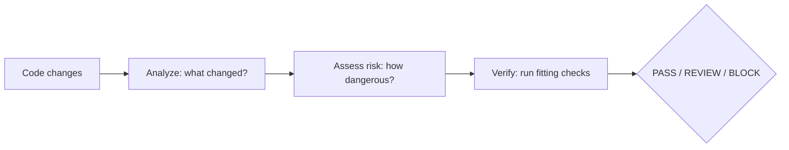

# AI Verify

> AI can generate code. AI Verify helps verify it.

[](https://www.npmjs.com/package/@fisaabil_/ai-verify)
[](https://www.npmjs.com/package/@fisaabil_/ai-verify)
[](https://nodejs.org/)

Open-source, risk-adaptive verification infrastructure for AI-generated software.
It analyzes what changed, assesses how risky it is, and runs only the checks
that fit — then reports a clear `PASS` / `REVIEW` / `BLOCK` verdict. Terminal-first,
zero-config, local-only.

## Contents

* [Try it in 60 seconds](#try-it-in-60-seconds)
* [How it works](#how-it-works)
* [Install](#install)
* [What the output means](#what-the-output-means)
* [Risk levels](#risk-levels)
* [Check statuses](#check-statuses)
* [Requirements](#requirements)
* [From source](#from-source)
* [Quality checks](#quality-checks)
* [Honesty rules](#honesty-rules)
* [Roadmap](#roadmap)
* [Contributing](#contributing)

## Try it in 60 seconds

No clone, no install — point it at any Git repository with uncommitted changes:

```bash
npx @fisaabil_/ai-verify@latest /path/to/your/repo
```

## How it works



1. **Analyze** — reads the Git diff: files, additions/deletions, languages.
2. **Assess risk** — scores 0–100 from security-sensitive paths, change size,
   and test coverage, with a reason for every factor.
3. **Verify** — runs only the checks relevant to the changed files
   (e.g. type check for TypeScript), aggregates findings in one format.

## Install

```bash
# Global: use anywhere
npm install -g @fisaabil_/ai-verify
ai-verify /path/to/your/repo

# One-off: no install at all
npx @fisaabil_/ai-verify@latest /path/to/your/repo

# Pinned for a team (inside your project)
npm install -D @fisaabil_/ai-verify
npx ai-verify .
```

No `sudo`, no config files, no extra services. The `ai-verify` command is
created automatically on install. If global install reports a permission
error, that comes from your npm prefix setup — prefer `npx` or point your
npm prefix at a directory you own.

## What the output means

<details>
<summary><b>Click to expand a full annotated example</b></summary>

```text
AI Verify v0.1.0 — AI can generate code. AI Verify helps verify it.
------------------------------
Files changed : 2
Additions     : +34
Deletions     : -4

Changes:
  modified src/auth/login.ts (typescript) +30/-4
  added    tests/auth.test.ts (typescript) +4/-0

Risk: MEDIUM (42)
Factors:
  +30 Authentication change — Touches authentication or authorization logic: src/auth/login.ts

Verification (857ms)
  ✓ Type Check — passed
Findings: 0
Result: PASS
```

</details>

* **Changes** — what the analyzer found in the working tree vs `HEAD`.
* **Risk** — level + score + one line per factor (always with a reason).
* **Verification** — one line per check that applied, then findings, then verdict.
* **Verdict** — `PASS` (clear), `REVIEW` (a check failed, a finding needs a human, or a risky change had no applicable verifier), `BLOCK` (a tool errored, a `critical` finding, or a `high` finding in `high`/`critical` risk). Risk alone never blocks — it selects verification depth.
* **Machine-readable** — `ai-verify /path/to/repo --json` prints `{ changeSet, risk, verification, verdict }` for CI and AI agents. See `examples/` for samples. `ai-verify --help` lists all flags.
* **Exit code** — `0` on `PASS`, `1` on `REVIEW`/`BLOCK`, so CI pipelines fail correctly.

## Risk levels

| Level | Score | Typical trigger |
|---|---|---|
| `NONE` | 0 | Docs-only changes |
| `LOW` | 1–29 | Config, small changes with tests |
| `MEDIUM` | 30–59 | Auth/DB touch, or code without tests |
| `HIGH` | 60–89 | Payment/secrets/security-sensitive code |
| `CRITICAL` | 90–100 | Combined high-risk factors at scale |

## Check statuses

| Status | Meaning |
|---|---|
| `passed` ✓ | Tool ran, no findings |
| `failed` ✗ | Tool ran, findings reported |
| `skipped` - | Not applicable (e.g. no TS files) or tool missing — always with a reason |
| `error` ! | Tool crashed or repo unreadable — fails the run, never silent |

A missing tool is **skipped**, never downloaded or installed for you.

## Requirements

* Node.js `>= 18`
* Git (target must be a Git repository; works with or without prior commits)

Check tools (like `tsc`) are used from the target repository itself when
available — never fetched from the network at run time.

## From source

```bash
git clone https://github.com/muhammadfisabilillah/ai-verify.git
cd ai-verify
npm install
npm run build
node dist/cli/index.js /path/to/your/repo
```

During development:

```bash
npm run dev -- /path/to/your/repo
```

## Quality checks

```bash
npm run check   # type check
npm run test    # tests
npm run build   # build
```

## Honesty rules

* A check that does not apply is `skipped` with a reason — never a failure.
* A missing tool is `skipped`, never downloaded or installed for you.
* A crashed tool is `error`, not silently treated as passed.
* A risky change with no applicable verifier is `REVIEW`, never a hollow `PASS`.
* Risk factors always carry a human-readable reason.

## Roadmap

<details>
<summary><b>Where this is going</b></summary>

* [x] Phase 1 — Change Detection (Git diff, languages, ChangeSet)
* [x] Phase 2 — Risk Engine v0.1 (scoring, factors, levels)
* [x] Phase 3 — Verification Engine v0.1 (type check, lint, aggregated findings)
* [x] Stabilisasi v0.2 — `--help/--version/--json`, risk-aware selection, `PASS / REVIEW / BLOCK`
* [ ] Phase 4 — Multi-language (Ruff done, pytest and more runners pending)
* [ ] Phase 5 — Developer integrations (GitHub Action, pre-commit, `--json`)
* [ ] Phase 6 — AI agent protocol (`PASS / REVIEW / BLOCK` loop)

</details>

See [`docs/workflow.md`](docs/workflow.md) for the full vision and architecture.

## Contributing

Issues and pull requests are welcome. Please keep slices small: one scope per
commit, contracts stable, `npm run check && npm run test && npm run build`
green before pushing.
